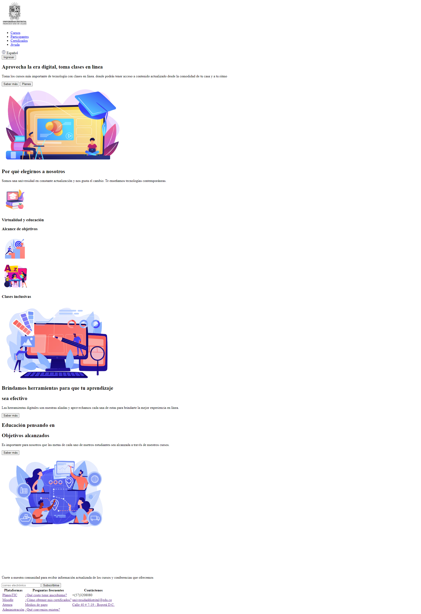
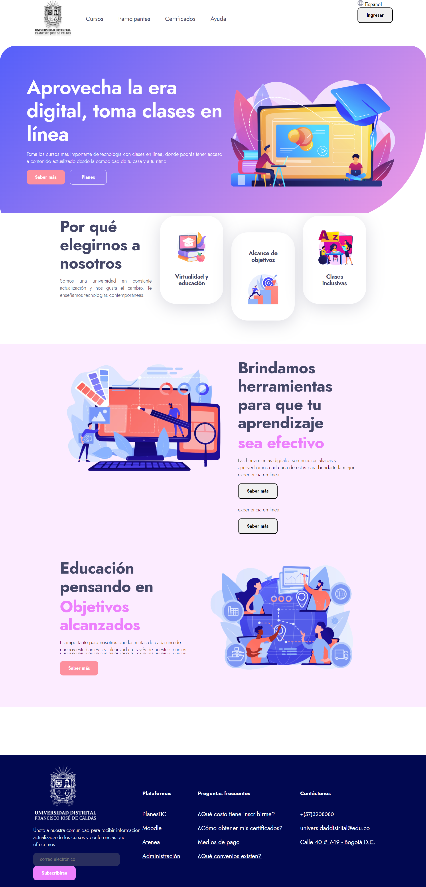
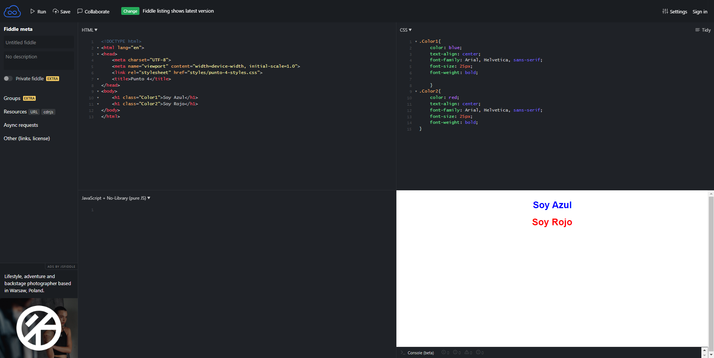
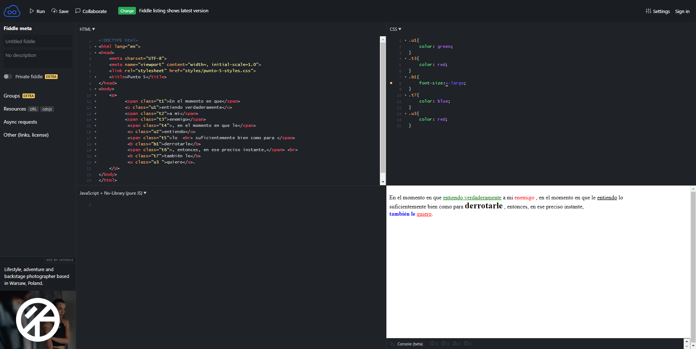
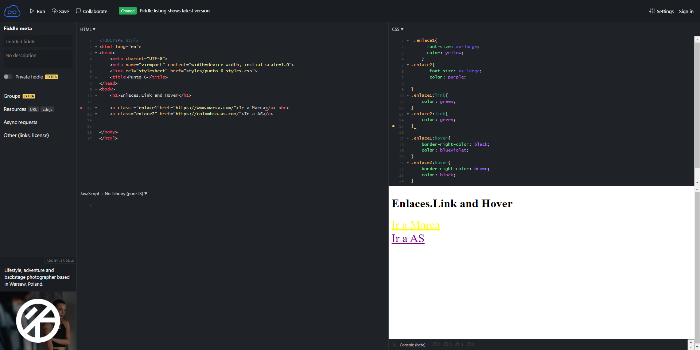

<h1>Taller 9 Julio Cesar Gonzalez Camacho/h1>

<h2> Información</h2>

Curso: full Stack Basico - Grupo 1

Profesor: Cristian Patiño

<h2> Punto 1: Link figma</h2>

<a href="https://www.figma.com/file/GAdDrvvO8QbTF7lcSvUxF1B/Julio-Cesar-Gonzalez-Camacho?type=design&node-id=5%3A260&mode=design&t=AayTVAwU4zARERrW-1" target="_blank">Link de Figma</a>

<h2> Punto 2: HTML</h2>

<h2> Punto 3: CSS</h2>

<h2> Punto 4: Azul y rojo</h2>

<h2> Punto 5: Parrafo</h2>

<h2> Punto 6: Enlace</h2>
